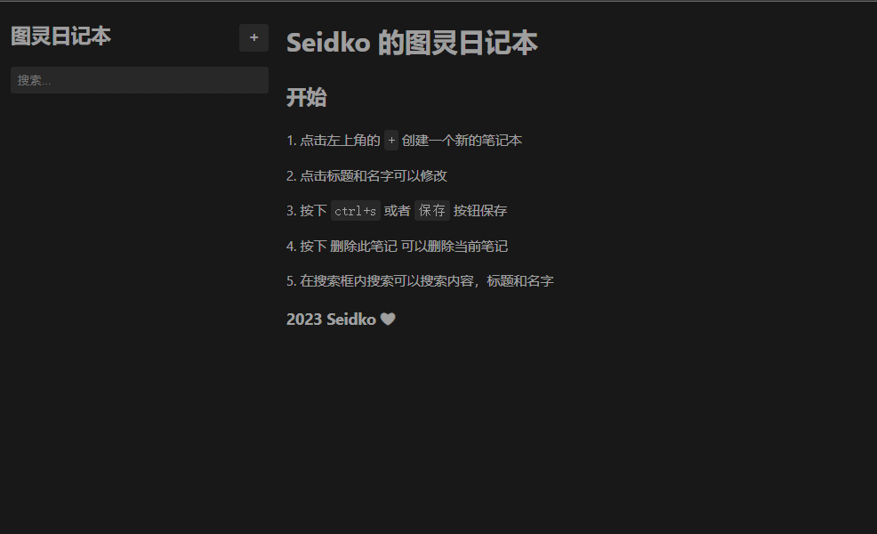
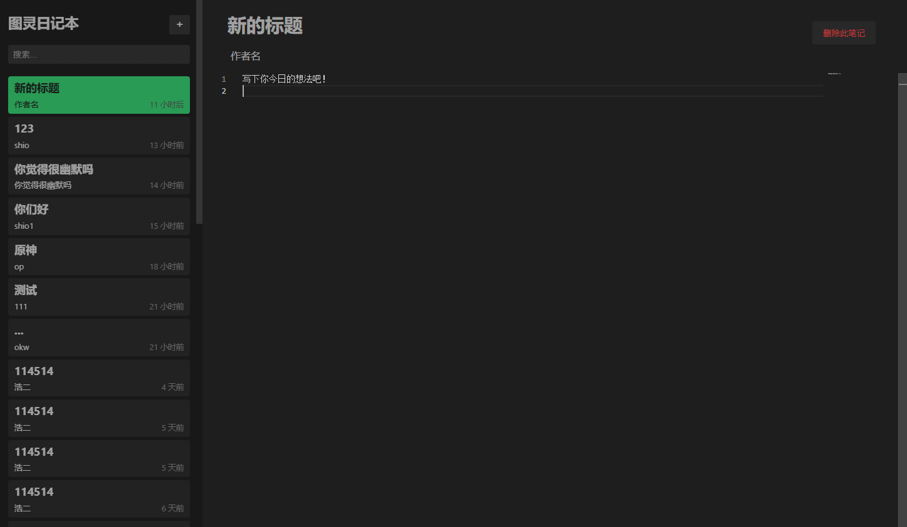
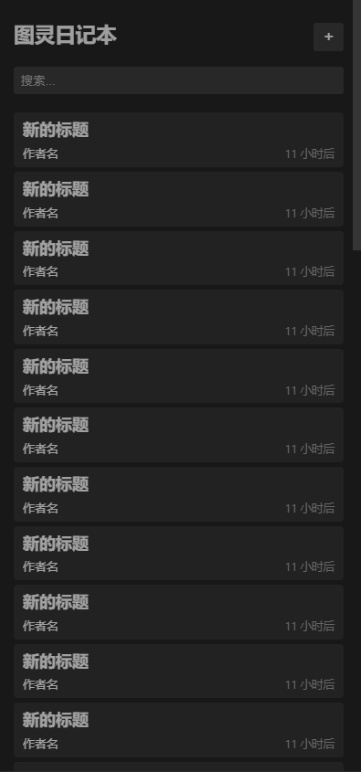
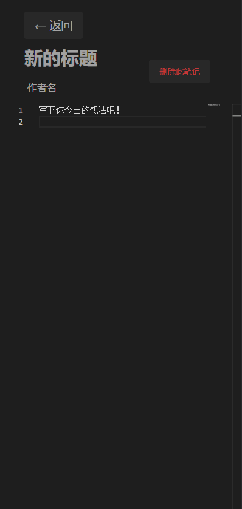

# Seidko 的图灵前端二轮考核

## Intro

Hi! 👋这里是 Seidko，这是我的前端考核项目，感谢各位大佬的访问。

在这个项目里，我已经完成了考核中的所有要求，并且加入了搜索和 [`Monaco`](https://github.com/microsoft/monaco-editor) 编辑器，使得日记的编辑有了 markdown 和代码块内的其他语言的高亮。

我自认为已经做得很好了，但我还是没能把我想做的很多东西做出来，而且我不会搞图标😂这让界面变得很丑，我的美工真的很差🙏，非常抱歉。

## 预览

## LICENSE

这个项目是个人学习项目，我还是一如既往地使用自己最喜欢的许可 MIT 来作为这个项目的许可吧~

许可可在[这里](./LICENSE)访问